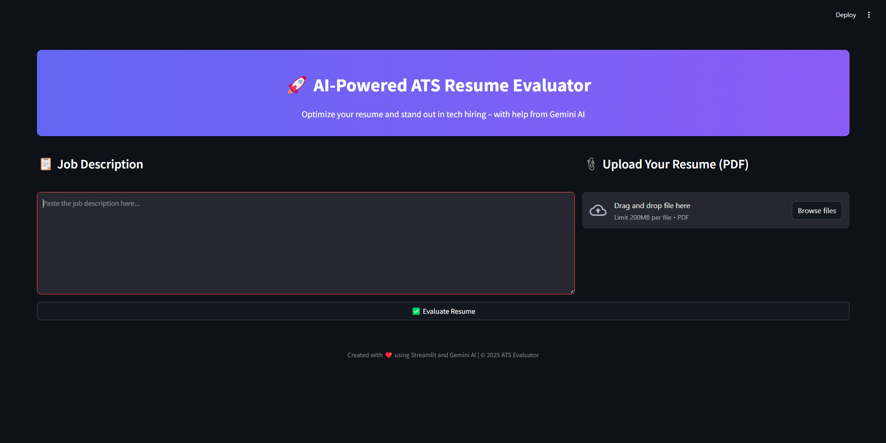

# 🤖 AI-Powered ATS Resume Evaluator

A smart, modern web app that evaluates tech resumes against job descriptions using **Google Gemini AI** and mimics an **ATS (Applicant Tracking System)**. Ideal for job seekers in Software Engineering, Data Science, and Big Data roles.

 <!-- Replace with your actual screenshot -->

---

## ✨ Features

- 📎 Upload your **PDF resume**
- 💼 Paste your **job description**
- 🤖 Get an **AI-powered evaluation** with:
  - Match Percentage
  - Missing Keywords
  - Suggested Improvements
- 🧠 Powered by **Google Gemini (1.5 Pro)**
- 🖥️ Clean, modern **Streamlit UI**

---

## 🚀 Demo

Live App: [Insert Your Live Link Here]

---

## 🛠️ Tech Stack

- [Streamlit](https://streamlit.io/)
- [Google Generative AI (Gemini)](https://ai.google.dev/)
- [PyPDF2](https://pypi.org/project/PyPDF2/)
- [dotenv](https://pypi.org/project/python-dotenv/)

---

## 📦 Installation

```bash
# Clone the repository
git clone https://github.com/Arshp-svg/ATS.git
cd ats-resume-evaluator

# Create a virtual environment
python -m venv venv
source venv/bin/activate  # On Windows use `venv\Scripts\activate`

# Install dependencies
pip install -r requirements.txt
```
##🔐Setup
Create a .env file in the root folder and add your Google Gemini API key:

```
GOOGLE_API_KEY=your_google_generative_ai_key
```
##▶️ Run the App
```
streamlit run app.py
```
